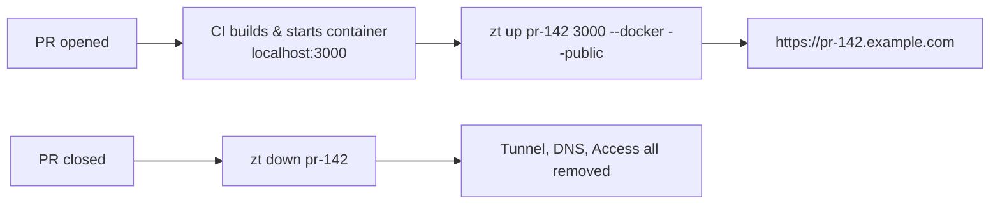
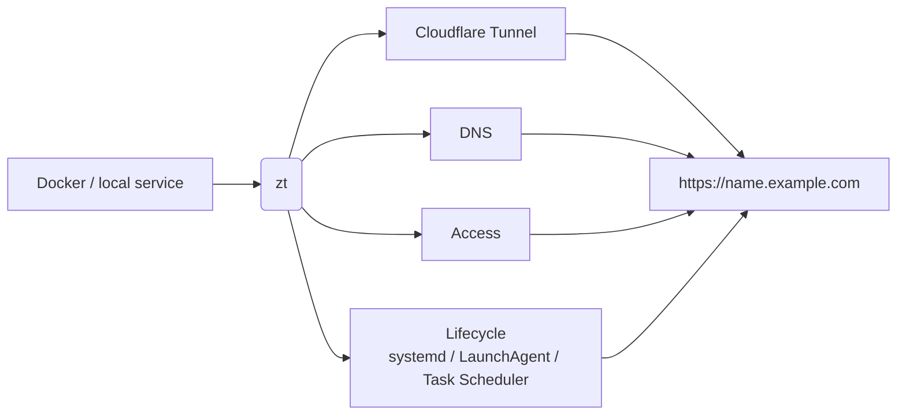

# zt — expose self-hosted services without the dashboard busywork

[](https://github.com/casablanque-code/cfzt/actions/workflows/ci.yml)
[](https://codecov.io/gh/casablanque-code/cfzt)
[](https://pkg.go.dev/github.com/casablanque-code/cfzt)
[](https://github.com/casablanque-code/cfzt/actions/workflows/gitleaks.yml)
[](https://www.tinytooltown.com/tools/cfzt/)
[](https://github.com/marketplace/actions/cfzt-preview-tunnel)
[](https://github.com/casablanque-code/cfzt/releases/latest)

You have a service running somewhere. `zt` gives it a secure public
endpoint through Cloudflare Zero Trust — no dashboard clicking, one command.

```bash
zt up portainer --docker --allow you@example.com
# → https://portainer.yourdomain.com  (ZT-protected, live in ~15s)
```


`zt up <name> <port>` creates the tunnel, ingress rules, DNS record, and
Access policy, and installs it as a service that survives reboots. `zt down
<name>` removes everything it created. See [What it does](#what-it-does) for
the full list.

## Use cases

`zt` doesn't care what's on the other end of the port — the same command
covers a few different jobs:

**Self-hosted apps & AI tools** — put a dashboard or a local model behind a
real HTTPS URL with login, instead of leaving it on `localhost` or opening a
port:

```bash
zt up grafana 3000 --docker --allow you@example.com
zt up open-webui 8080 --docker --allow you@example.com
```

**Home automation** — reach Home Assistant, Frigate, or Node-RED from
outside your LAN without a VPN client on every device:

```bash
zt up home-assistant 8123 --docker --allow you@example.com
```

**PR preview environments** — give each pull request its own public URL for
review, and tear it down when the PR closes:



```bash
# on PR open, in CI, after the container is up on localhost:3000
# --public: preview links need to be viewable without a Cloudflare Access
# login, same as a Vercel/Netlify preview URL — swap in --allow if your
# previews should stay restricted to your team
zt up pr-142 3000 --docker --public

# on PR close
zt down pr-142
```

Self-hosted preview URLs without Vercel, Netlify, or a hosted preview
platform. `casablanque-code/cfzt` ships a composite action wrapping the
`zt up`/`zt down` calls above and reflecting them in the GitHub
Deployments UI — see [GitHub Action](#github-action) below.

---

## GitHub Action

`casablanque-code/cfzt` is also a composite action wrapping `zt up`/`zt
down` for exactly the PR-preview flow above, plus a GitHub Deployment +
Deployment Status so the preview URL shows up in the PR's own UI, not just
build logs.

```yaml
- uses: casablanque-code/cfzt@v0.10.0
  with:
    mode: up   # or: down
    name: pr-${{ github.event.number }}
    port: '3000'
    docker: 'true'
    public: 'true'   # or use `allow:` to restrict to your team
    domain: example.com
    cloudflare-api-token: ${{ secrets.CLOUDFLARE_API_TOKEN }}
    cloudflare-account-id: ${{ secrets.CLOUDFLARE_ACCOUNT_ID }}
```

Full example workflow, input reference, and notes on state/matching
across CI runs: **[docs/github-action.md](docs/github-action.md)**.

## What it does

`zt up <name> <port> --allow <mail@example.com>` automatically:

1. Creates a Cloudflare Tunnel
2. Configures ingress rules
3. Upserts a CNAME DNS record (replaces a stale zt-created record automatically; refuses to touch a foreign record unless `--force` is given)
4. Creates a Zero Trust Access application with an access policy
5. Installs and starts a systemd (Linux), LaunchAgent (macOS), or Task
   Scheduler (Windows) service
6. Saves state locally



`zt down <name>` attempts to remove all created resources. It looks the
tunnel up in local state by default; pass `--remote` to resolve it
directly from Cloudflare by name instead, for tearing down from a
different machine than the one `zt up` ran on (e.g. CI — see the
[GitHub Action](#github-action) section).

---

## Prerequisites

- A domain on Cloudflare
- [`cloudflared`](#installing-cloudflared) ≥ 2023.x installed and in PATH
- A Cloudflare API token with the following permissions:
  - `Account / Cloudflare Tunnel / Edit`
  - `Zone / DNS / Edit`
  - `Account / Access: Apps and Policies / Edit`

### Installing cloudflared

`zt` drives `cloudflared` but doesn't install or manage it — use your platform's
package manager so future upgrades are a normal `upgrade`/`update`, not a manual
re-download:

| Platform | Install | Upgrade |
|---|---|---|
| macOS (Homebrew) | `brew install cloudflared` | `brew upgrade cloudflared` |
| Debian/Ubuntu (apt) | see [Cloudflare's apt repo setup](https://pkg.cloudflare.com/index.html#debian-any) | `sudo apt update && sudo apt install --only-upgrade cloudflared` |
| Other Linux / binary | [Releases](https://github.com/cloudflare/cloudflared/releases) | re-download and replace the binary |
| Windows | [Releases](https://github.com/cloudflare/cloudflared/releases) | re-download and replace the binary — see [Windows support](#windows-support) |

`zt doctor` checks the installed version and, if it's outdated, prints the
right upgrade command for how it detects `cloudflared` was installed
(Homebrew/apt) or falls back to the releases link otherwise.

### Creating the API token

1. Cloudflare dashboard → **My Profile** → **API Tokens** → **Create Token**
2. Use **Custom token**, add the permissions above
3. Set Account Resources → your account
4. Set Zone Resources → your domain

---

## Install

### Option A — install script (recommended)

```bash
curl -fsSL https://raw.githubusercontent.com/casablanque-code/cfzt/main/install.sh | bash
```

Downloads the correct binary for your OS and architecture, verifies the SHA-256 checksum, and places it in `/usr/local/bin/zt`.

### Option B — go install

```bash
go install github.com/casablanque-code/cfzt/cmd/zt@latest
```

### Option C — build from source

```bash
git clone https://github.com/casablanque-code/cfzt
cd cfzt
go build -o zt ./cmd/zt
sudo mv zt /usr/local/bin/
```

### Option D — Homebrew (macOS + Linux)

```bash
brew tap casablanque-code/cfzt https://github.com/casablanque-code/cfzt
brew install zt
```

The formula lives in this repo's [`Formula/`](Formula/) folder and updates itself automatically on every release (same mechanism as the Scoop bucket below). `brew upgrade zt` picks up new versions.

### Option E — download binary

Download from [Releases](https://github.com/casablanque-code/cfzt/releases) and place in your PATH. Each release includes `.sha256` checksum files and a combined `checksums.txt`.

### Option F — Scoop (Windows)

```powershell
scoop bucket add cfzt https://github.com/casablanque-code/cfzt
scoop install cfzt/zt
```

The bucket lives in this repo's [`bucket/`](bucket/) folder and updates itself automatically on every release. To pick up a new version, run `scoop update` (no arguments) first — that's what actually `git pull`s the bucket repos — then `scoop update zt`. Running `scoop update zt` on its own can still report the old version if the bucket itself hasn't been refreshed yet.

`zt.exe` is a console app — double-clicking it in Explorer will show a
"you need to open cmd.exe" prompt; always run it from a terminal. See
[docs/windows.md](docs/windows.md) for that and other Windows-specific
gotchas (PATH setup, task scheduling, troubleshooting).

---

## Windows support

`zt up` installs a Task Scheduler task (`zt-<name>`, logon trigger,
restart-on-failure) — the same auto-start/auto-restart guarantee
systemd/launchd give on Linux/macOS. It runs under your own logon session
with no stored credentials and no admin prompt, same permission model as
`systemctl --user` / a per-user LaunchAgent.

Windows install: [Scoop](#option-f--scoop-windows) (recommended,
self-updating). A WinGet package is in progress — see the issue tracker
for status.

Full details, gotchas, and Windows-specific troubleshooting:
**[docs/windows.md](docs/windows.md)**.

---

## Setup

```bash
zt init
```

You will be prompted for three values:

| Field | Where to find it |
|---|---|
| API Token | Cloudflare → My Profile → API Tokens |
| Account ID | Cloudflare dashboard → right sidebar |
| Domain | Your domain as it appears in Cloudflare (e.g. `example.com`) |

`zt init` validates the token and domain against the Cloudflare API before saving. Config is stored at `~/.zt-config.json` (mode 0600).

---

## Usage

### Bring up a tunnel

```bash
zt up <name> <port> --allow you@example.com
# or: zt up <name> <port> --public
```

`--allow` or `--public` is required — `zt` always makes you choose
explicitly whether a service needs a login or not; there's no implicit
default.

```bash
# Restrict access to specific email (Cloudflare sends OTP to that address)
zt up portainer 9000 --allow you@example.com

# Multiple allowed emails
zt up vault 8200 --allow alice@example.com --allow bob@example.com

# Auto-detect port from a running Docker container
zt up portainer --docker --allow you@example.com

# No Zero Trust gate — public access, no Access app created
zt up api 8080 --public

# Force TCP if QUIC is blocked by your ISP
zt up portainer 9000 --allow you@example.com --tcp
```

The service becomes available at `https://<name>.<domain>`.

The tunnel is registered as a system service and survives reboots automatically.

### Tear down a tunnel

```bash
zt down portainer
```

Stops the system service, removes local config files, deletes the DNS record, removes the Zero Trust Access app, and deletes the tunnel from Cloudflare.

### List tunnels

```bash
zt list      # or: zt ls
```

```
NAME        URL                             PORT   PROTOCOL      ACCESS         STATUS   MANAGED BY
portainer   https://portainer.example.com   9000   auto (quic)   ZT (1 email)   running  systemd
grafana     https://grafana.example.com     3000   http2 (TCP)   public         stopped  pid 84291
```

### Tunnel details

```bash
zt status portainer
```

```
  portainer
  URL:        https://portainer.example.com
  Port:       9000
  Tunnel ID:  07fc193d-d05e-48eb-bb00-22be71823b14
  Managed by: systemd
  Protocol:   http2 (TCP)
  Access:     ZT (1 email)
  Status:     running
  Created:    2026-05-27 00:01:08
  Log:        /root/.zt/tunnels/portainer/cloudflared.log
```

### View logs

```bash
# last 50 lines
zt logs portainer

# last 100 lines
zt logs portainer -n 100

# follow (like tail -f)
zt logs portainer -f

# show logs inline with status
zt status portainer --logs
```

### Backup & restore

```bash
zt export                   # writes zt.yaml in the current directory
zt apply zt.yaml            # recreate the same services elsewhere (zt init first)
```

`zt export` snapshots everything zt manages into a portable manifest
(credentials excluded, safe to commit). `zt apply` diffs it against local
state and only creates what's missing — re-running it is safe, existing
tunnels are reported and skipped, never modified or deleted automatically.

Manifest format, the full apply/skip behavior, and an example:
**[docs/backup-restore.md](docs/backup-restore.md)**.

### QUIC/HTTP2 fallback watchdog

cloudflared falls back from QUIC to HTTP/2 when UDP is blocked, but never
retries QUIC on its own even after the network recovers
([cloudflare/cloudflared#1534](https://github.com/cloudflare/cloudflared/issues/1534)).

```bash
zt watchdog enable     # install as a background service, checks every 30s
zt watchdog status     # check if it's running
zt watchdog disable    # remove it
```

How it detects fallback, backoff behavior, and a known race with manual
restarts: **[docs/watchdog.md](docs/watchdog.md)**.

### Health check

```bash
zt doctor
```

```
  System

  ✓  cloudflared installed
     version: cloudflared version 2024.1.0

  Cloudflare

  ✓  API token valid
  ✓  domain example.com found in Cloudflare

  Tunnel: portainer

  ✓  systemd service zt-portainer.service active
  ✓  local service on port 9000 reachable
  ✓  DNS resolves portainer.example.com
  ✓  Cloudflare tunnel exists

  ✓ all checks passed
```

### Checking your version

```bash
zt version
# or: zt --version
```

Both print the running version and, unless `ZT_NO_UPDATE_CHECK=1` is set,
do a quick (1.5s timeout) check against GitHub for a newer release —
silently skipped if there's no network, since zt is meant to work fine
offline. `zt doctor` does the same check and surfaces it alongside the
rest of the system report.

---

## Flags

### `zt export`

| Flag | Description |
|---|---|
| `-o <path>` | Output path (default: `zt.yaml` in current directory) |

### `zt apply`

| Flag | Description |
|---|---|
| `--force` | Accept a manifest that changed since it was last applied |

`zt apply <file>` reads the manifest at `<file>` and creates any missing services. It remembers the content of the manifest it last applied; if `<file>` has changed since then — edited, or replaced by something else entirely — it shows the diff and refuses to proceed until re-run with `--force`.

### `zt watchdog`

| Subcommand | Description |
|---|---|
| `enable` | Install and start the watchdog as a background service |
| `disable` | Stop and remove the watchdog service |
| `status` | Show whether the watchdog is running |

### `zt up`

One of `--allow` or `--public` is required.

| Flag | Description |
|---|---|
| `--allow <email>` | Restrict access to this email via Cloudflare Access (repeatable) |
| `--public` | No Zero Trust gate — skip Access app entirely |
| `--docker` | Auto-detect port from a running Docker container with this name |
| `--container-port <n>` | Which container-side port to expose when the container publishes more than one (requires `--docker`) |
| `--tcp` | Force TCP (http2) — use if QUIC/UDP is blocked by your ISP |
| `--protocol <proto>` | Protocol: `auto` (default), `quic`, `http2` |
| `--force` | Replace an existing DNS record for the hostname even if zt didn't create it |

### `zt logs`

| Flag | Description |
|---|---|
| `-n <lines>` | Number of lines to show (default: 50) |
| `-f` | Follow log output |

### `zt status`

| Flag     | Description                    |
| -------- | ------------------------------- |
| `--logs` | Show recent log output inline   |

`zt status <name>` and `zt <name> status` are equivalent — same for `logs`, `restart`, and `down`.

---

## Shell completion

`zt` uses [Cobra](https://github.com/spf13/cobra), which ships tab-completion out of the box:

```
# bash (current shell)
source <(zt completion bash)

# bash (persist)
zt completion bash | sudo tee /etc/bash_completion.d/zt

# zsh
zt completion zsh > "${fpath[1]}/_zt"

# fish
zt completion fish > ~/.config/fish/completions/zt.fish
```

Run `zt completion --help` for details per shell.

---

## Version

```
zt --version
```

There is currently no `zt update` command — `zt` is a single static binary with no
auto-updater. To upgrade, re-run the install script or `go install` (see
[Install](#install)), which simply overwrites the existing binary in place:

```
curl -fsSL https://raw.githubusercontent.com/casablanque-code/cfzt/main/install.sh | bash
```

---

## File layout

```
~/.zt-config.json                      # credentials (0600)
~/.zt-state.json                       # tunnel state (0600)
~/.zt/tunnels/<name>/                  # cloudflared config, credentials, log per tunnel
```

Full layout including per-platform service files:
**[docs/file-layout.md](docs/file-layout.md)**.

---

## Troubleshooting

Run `zt doctor` first — most issues are diagnosed automatically.

Common issues (`cloudflared not found`, `502 Bad Gateway`, tunnel shows
`stopped`, DNS record conflicts, Windows task not starting, and more) with
fixes: **[docs/troubleshooting.md](docs/troubleshooting.md)**.

---

## License

MIT
